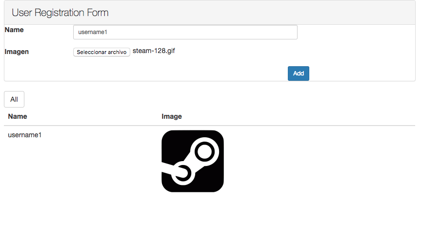

# Desafio Acid Labs
> Prueba de ingreso a acidlabs.

[![Build Status][travis-image]][travis-url]

El proyecto esta conformado por un cliente desarrollado con AngularJS, que consume servicios rest proporcionados por la aplicación realizada con Spring boot.

## Captura de pantalla de cliente realizado con AngularJS 

## Repuesta de servicios y estados

Para verificar el correcto funcionamiento de lo solicitado, es necesario usar algun programa como Postman y comprobar cada una de las solicitudes explicadas en el punto WebService y Servidor

### WebService y Servidor

1.- Se ha implementado un servicio Web, con la estructura http://localhost:8080/users. Este servicio recibie un request POST con el siguiente contenido JSON:
{
  “username”: String,
  "image"   : String
}

Cuando se envía el valor "usuario1" como username, guardará los datos, para cualquier otro nombre de usuario, retornará que el webservice es 401 (Unauthorized).
{
  "message" : "Unauthorized"
}

Si es un usuario autorizado y los parámetros image y username contienen datos,  persistirá la información, en cuyo caso el webservice retornara código 201 (Created) sin body en el response.

Si alguno de los parámetros no contiene datos se retorna 400 (Bad Request)
{
  "message" : "Bad Request"
}

## Release History

* 0.1.0
    * CHANGE: Actualizacion de archivos y documentacion
* 0.0.1
    * Progresando en el proyecto

## Meta

Gregory Llanos – [@GregoryFLM](https://twitter.com/GregoryFLM) – llanosgreg@gmail.com

[https://github.com/gregflm/github-link](https://github.com/gregflm)

[npm-image]: https://img.shields.io/npm/v/datadog-metrics.svg?style=flat-square
[npm-url]: https://npmjs.org/package/datadog-metrics
[npm-downloads]: https://img.shields.io/npm/dm/datadog-metrics.svg?style=flat-square
[travis-image]: https://img.shields.io/travis/dbader/node-datadog-metrics/master.svg?style=flat-square
[travis-url]: https://travis-ci.org/dbader/node-datadog-metrics
